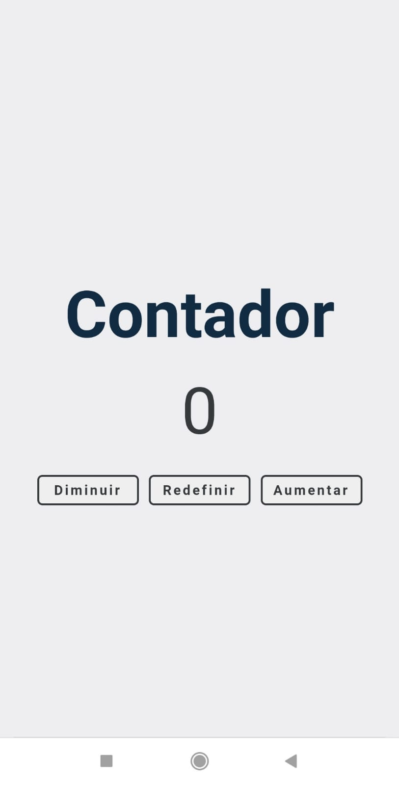

# Contador

> ⚠️ Este projeto foi baseado na lista de projetos do Autor Daniel Rosa, publicado em seu Blog. Acesse [aqui](https://www.freecodecamp.org/portuguese/news/40-projetos-em-javascript-para-iniciantes-ideias-simples-para-comecar-a-programar-em-js/).
 

O Projeto tem como principal função ser um simples contador, onde você pode Aumentar, Diminuir e Redefinir.

Para este projeto foi utilizado as seguintes tecnologias:

- HTML5
- CSS3
- JavaScript

### Versão Mobile:

### Versão DeskTop:

Para visualizar o projeto em produção, [Clique Aqui](https://gtm35.github.io/Contador/).
